# AgentX UI v0.3 图册

24 张主图 + 1 张澄清表单补充图。用户已确认作为 V1 采用稿；它们是设计稿，不是运行截图。此图册只展示本轮采用稿；原图及修订前版本均保留。

[返回评审索引](README.md) · [查看 PRD](../../../prd/AgentX_Desktop_PRD.md)

## 01 · 新会话工作台

所属：app-shell、workbench。对应规格：UI-NAV-INLINE、UI-COMPOSER。

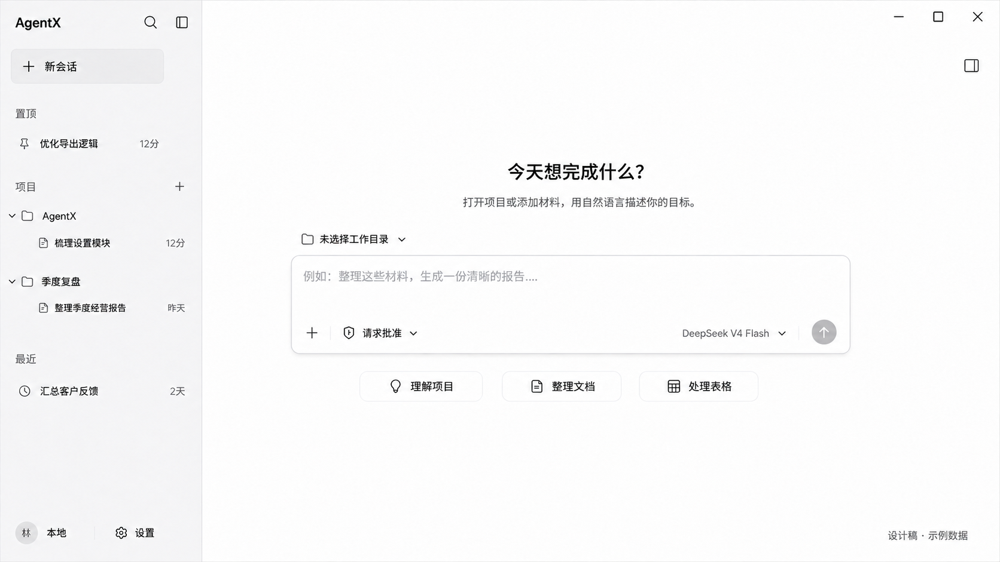

已检查：单一附件入口、发送控件、模型选择器、侧栏无重复任务和已取消入口。

## 02 · 项目菜单与会话操作

所属：app-shell。对应规格：UI-NAV-INLINE。

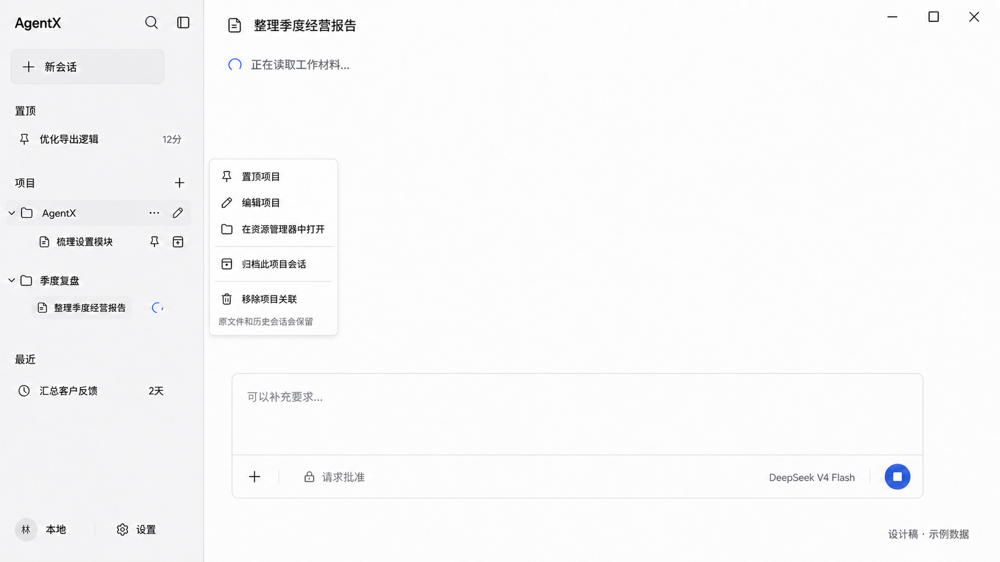

已修正活动轮模型/权限只读与输入区域；项目菜单保留，hover 操作与活动标记分开。

## 03 · 编辑项目名称与目录重联

所属：app-shell。对应规格：UI-NAV-INLINE。

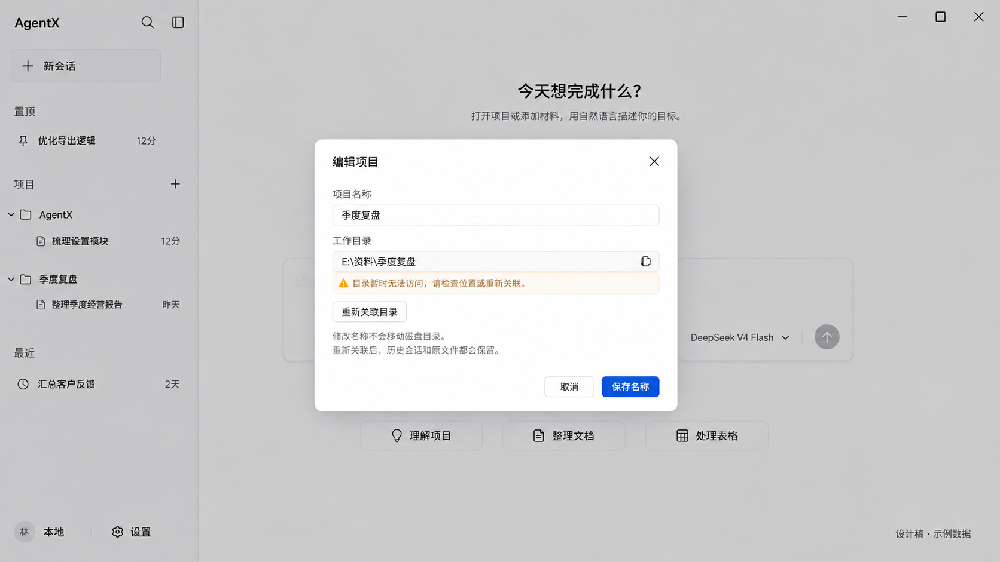

已检查：名称与只读路径分开、失效目录有重联入口、不移动文件。

## 04 · 标题与正文搜索

所属：app-shell。对应规格：UI-SEARCH-CONTENT。

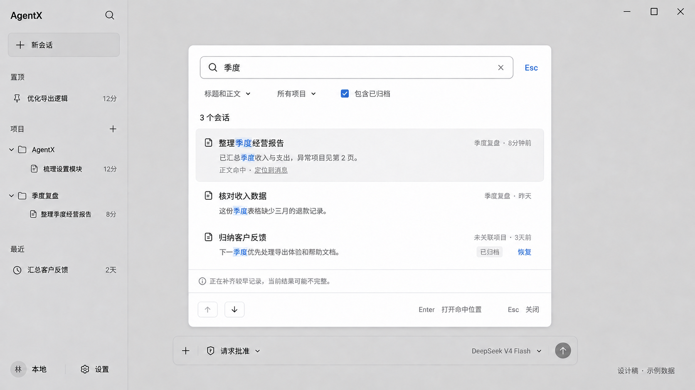

已统一同一会话在侧栏与搜索结果中的最近活动时间，搜索范围与命中定位保持。

## 05 · 材料添加与模型选择

所属：workbench。对应规格：UI-COMPOSER、UI-SETTINGS-MODELS。

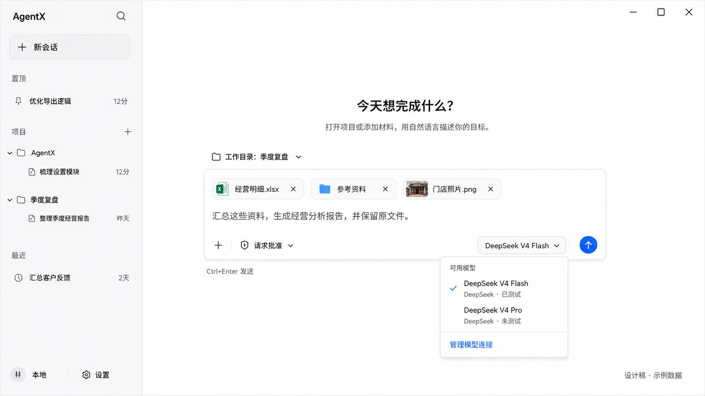

已检查材料类型、单一添加入口、工作目录区分、候选模型单选和管理入口。

## 06 · 执行中与表格预览

所属：workbench。对应规格：UI-RUN-FEEDBACK、UI-CONTENT-PANELS。

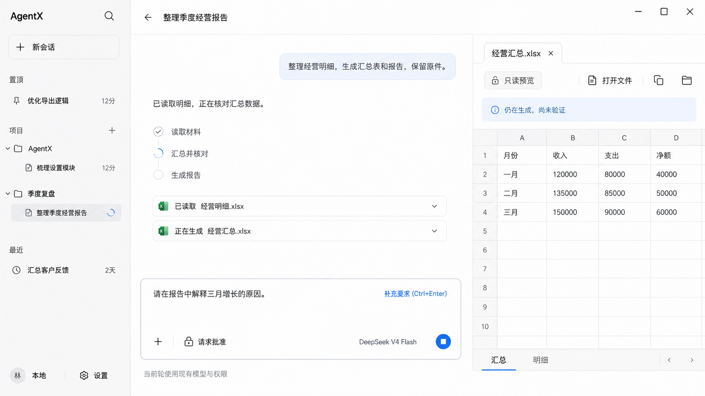

已检查：真实活动标记、只读表格及未验证提示、当前轮配置只读、补充文字动作和单一停止。

## 07 · 审批与补充信息

所属：workbench。对应规格：UI-RUN-FEEDBACK。

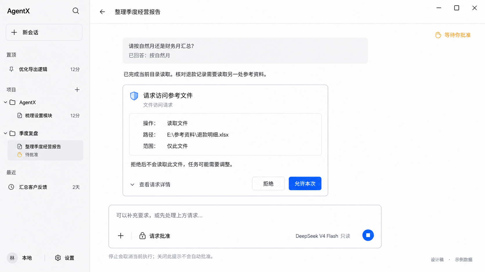

已检查具体操作范围、一次授权/拒绝、已回答澄清与待审批区分、等待标记和停止。

## 07B · 等待回答的澄清表单

所属：workbench。对应规格：UI-RUN-FEEDBACK。

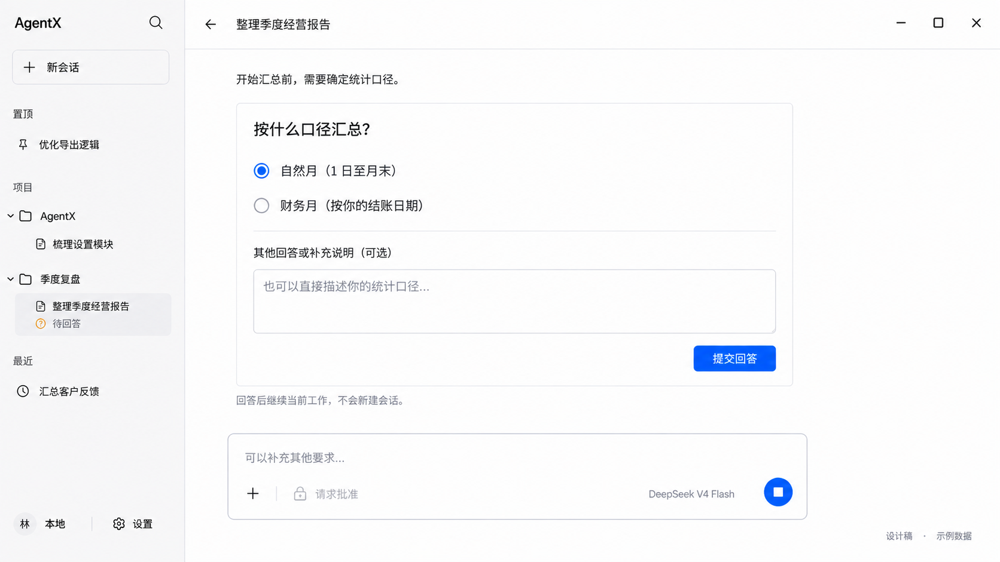

已补齐待回答表单：单选与自由补充、显式提交、待回答标记，与权限审批和停止分离。

## 08 · 文档结果检查

所属：workbench。对应规格：UI-CONTENT-PANELS。

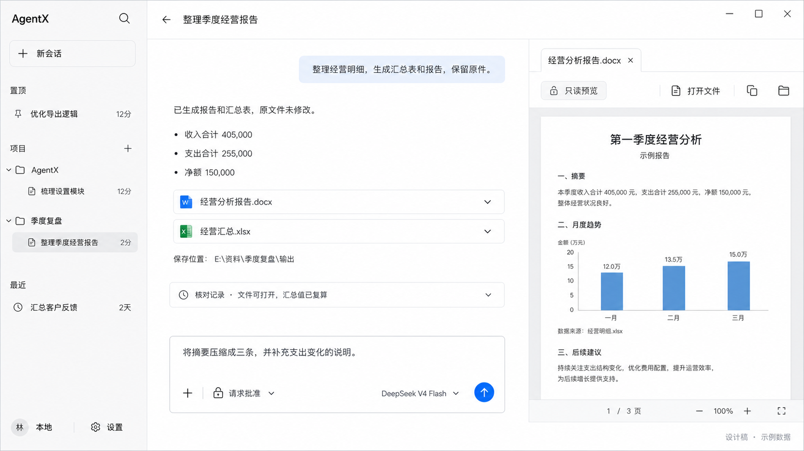

已检查：真实路径与结果引用、只读文档、核对记录、自然语言继续修改，无验收入口。

## 09 · 代码改动检查

所属：workbench。对应规格：UI-CONTENT-PANELS。

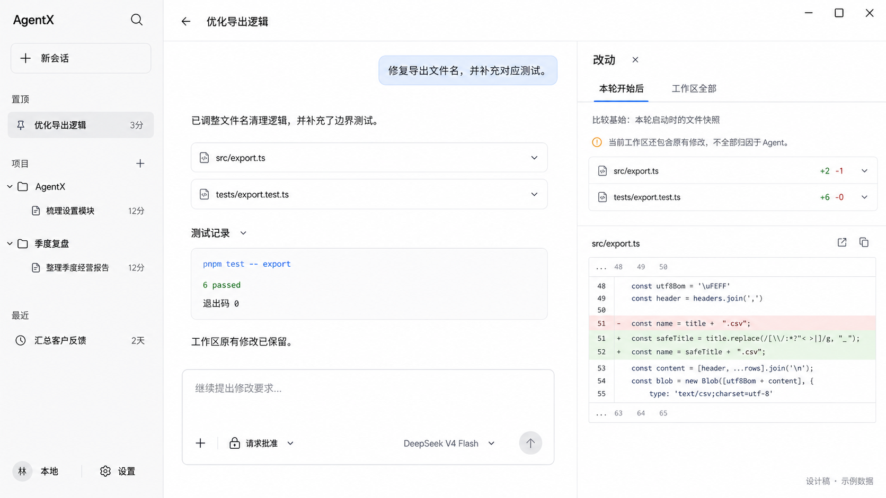

已检查比较范围、原有修改提示、文件差异与验证记录；截图中的代码和测试均为示例。

## 10 · 执行失败与只读输出

所属：workbench。对应规格：UI-RUN-FEEDBACK、UI-CONTENT-PANELS。

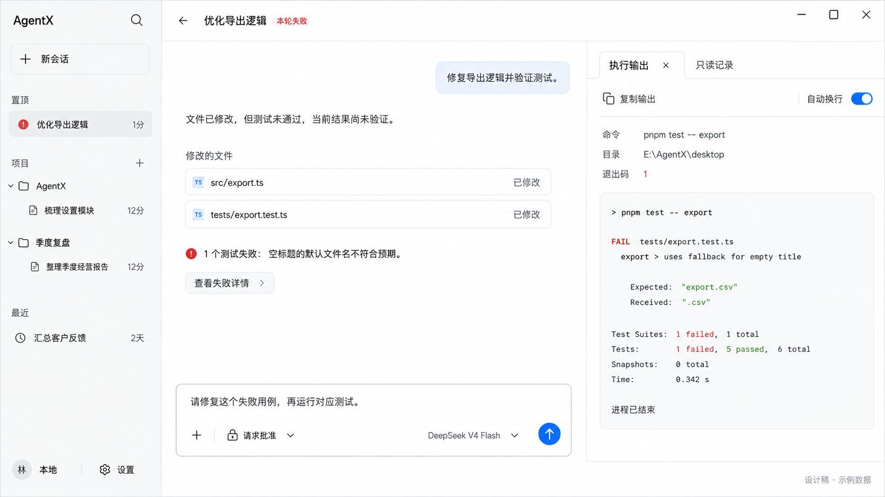

已检查失败状态、部分产物、退出码、只读输出、自然语言重试；无完成勾或自动重放按钮。

## 11 · 真实交互终端

所属：workbench。对应规格：UI-CONTENT-PANELS。

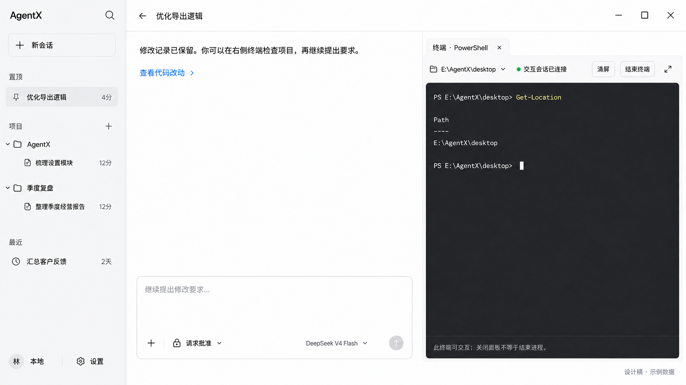

已补齐对话多行输入区域；终端和独立进程控制保持原样。

## 12 · PDF 与图片预览

所属：workbench。对应规格：UI-CONTENT-PANELS。

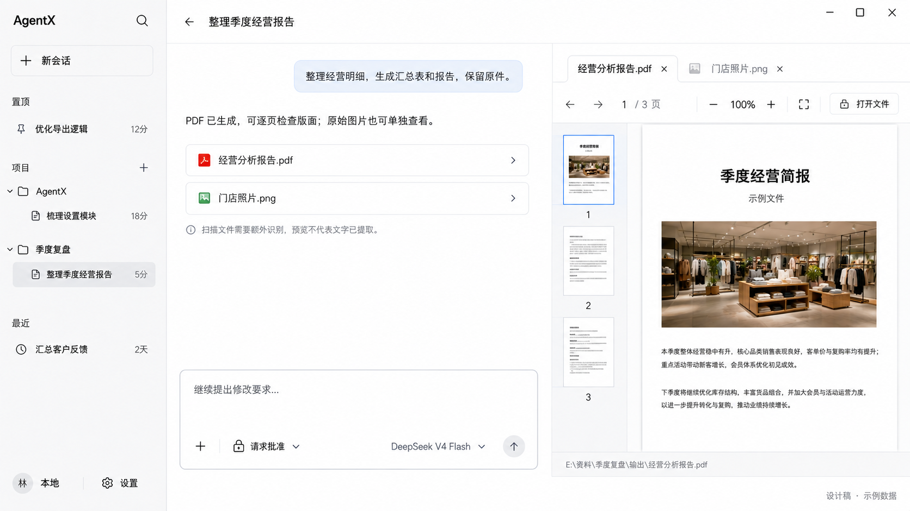

已检查本地 PDF 页码、缩放、缩略图、图片标签、打开文件与扫描内容说明。

## 13 · 浏览器工作与接管

所属：workbench。对应规格：UI-CONTENT-PANELS。

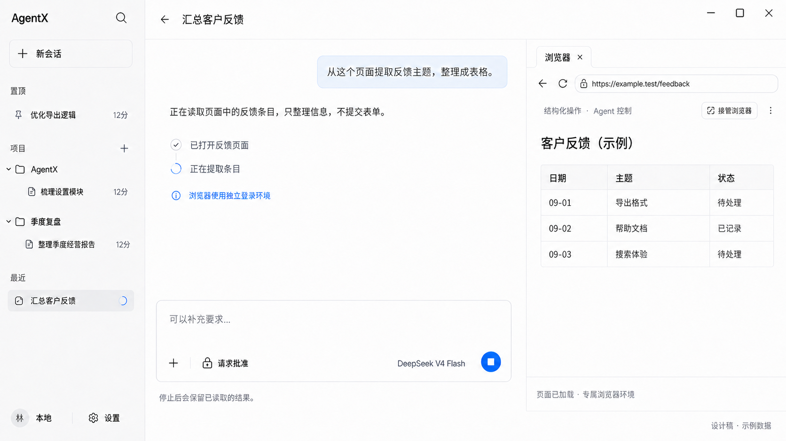

已检查控制方式和控制者；已修正运行会话误留时间，保留唯一停止与独立浏览器环境提示。

## 14 · 电脑操作与人工接管

所属：workbench。对应规格：UI-CONTENT-PANELS。

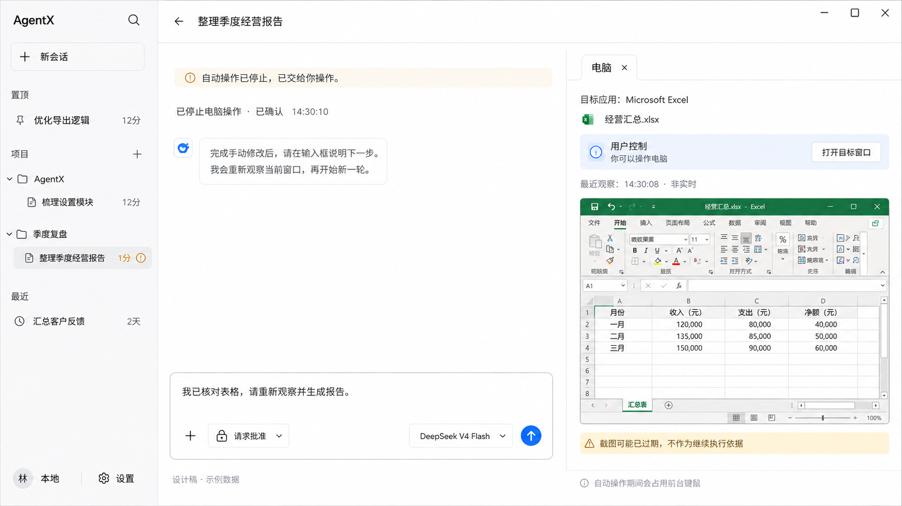

已检查接管后停止确认、用户控制、非实时观察时间和显式新轮继续。截图内 Excel 控件属于目标软件，不是 AgentX 办公编辑器。

## 15 · 模型连接设置

所属：settings。对应规格：UI-SETTINGS-MODELS。

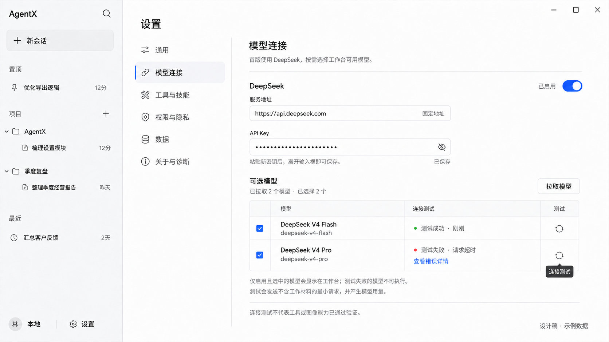

已检查多选、启停、Key 默认密文与眼睛、拉取与逐项测试、成功失败说明；已移除含义不明的表头测试图标。

## 16 · 工具与授权

所属：settings。对应规格：UI-SETTINGS-TOOLS。

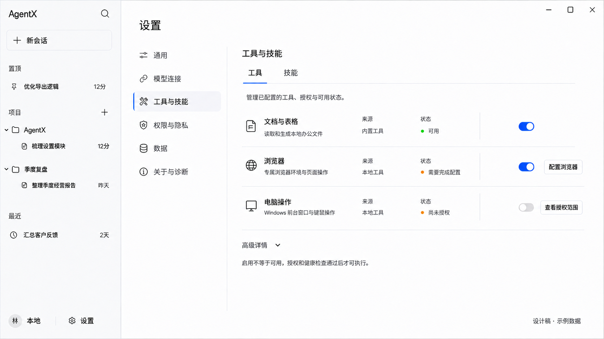

已统一设置壳层标题与页内标题，启停开关对齐；移除重复状态标签，确保电脑操作关闭且未授权，浏览器开启但配置不完整。

## 17 · 技能与来源

所属：settings。对应规格：UI-SETTINGS-TOOLS。

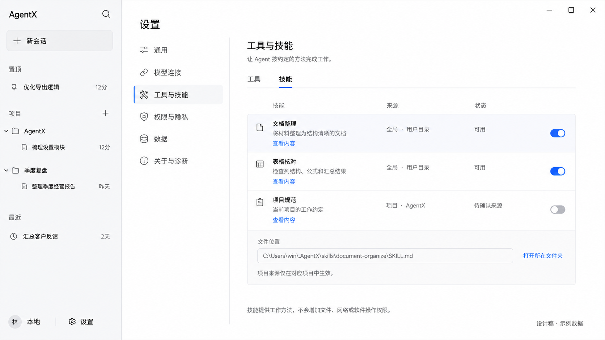

已检查全局/项目来源、可用与待确认状态、文件位置和权限不随技能扩大。

## 18 · 权限与隐私

所属：settings。对应规格：UI-SETTINGS-PERMISSIONS。

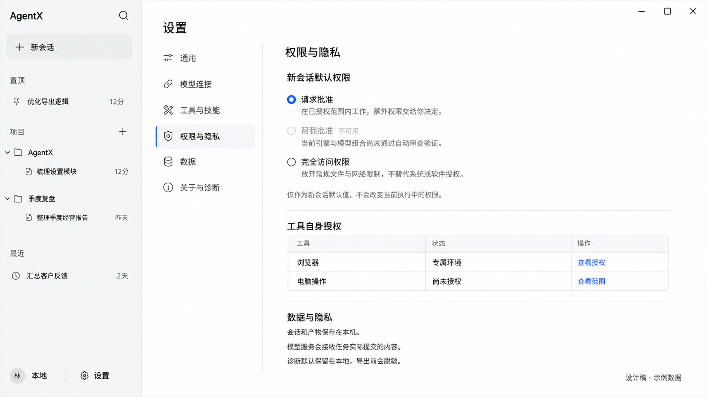

已检查三档单选、自动批准不可用原因、新会话默认生效和工具授权分离。

## 19 · 本地数据与备份

所属：settings。对应规格：UI-SETTINGS-DATA。

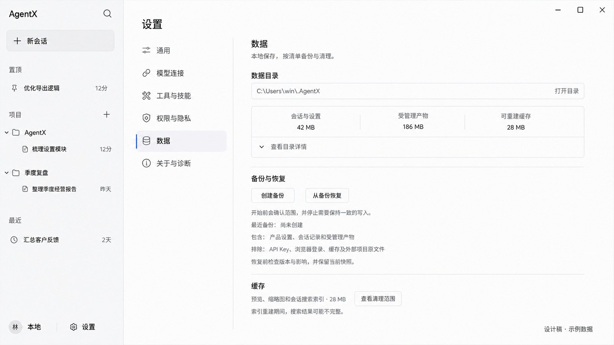

已检查数据根目录、备份包含/排除、恢复快照、缓存范围及索引重建提示。

## 20 · 通用设置与工作偏好

所属：settings。对应规格：UI-SETTINGS-GENERAL。

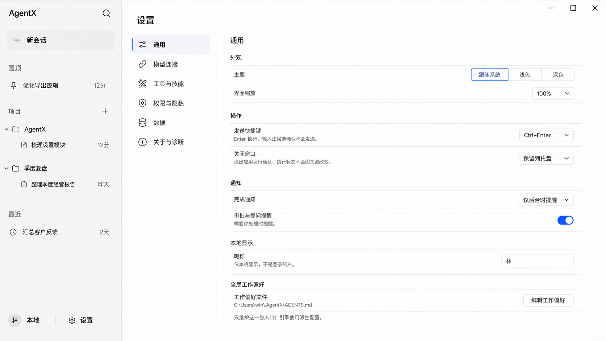

已检查主题、缩放、输入快捷键、托盘、通知、本地昵称及全局偏好唯一入口。

## 21 · 关于与诊断

所属：settings。对应规格：UI-SETTINGS-DIAGNOSTICS。

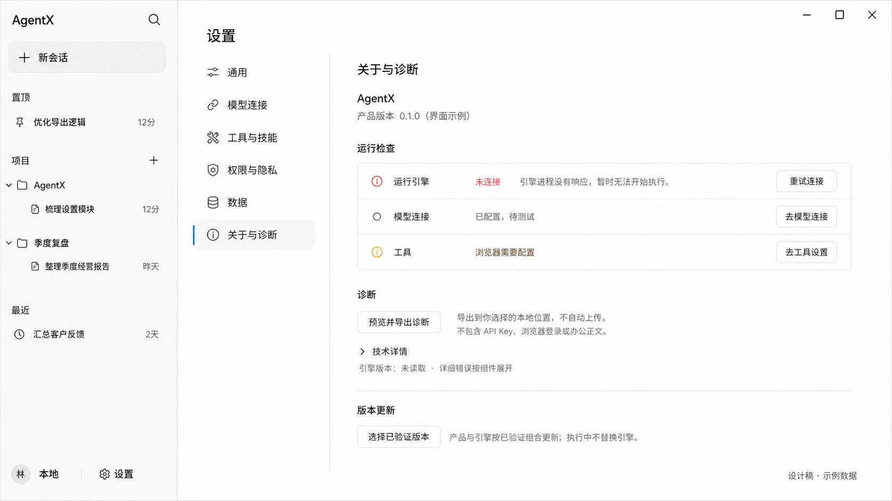

已检查组件健康、错误影响、修复入口、诊断本地导出及产品/引擎组合更新，无全局假成功或无归属用量。

## 22 · 未配置与材料失败

所属：workbench。对应规格：UI-COMPOSER。

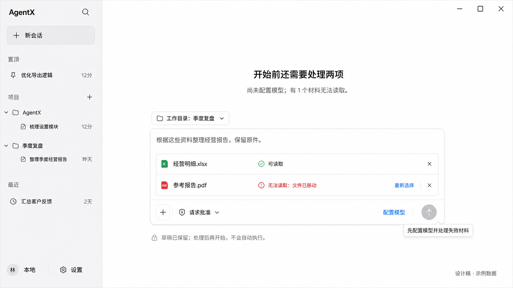

已检查材料可读/失败区分、处理入口、禁用发送、草稿保留和不自动执行。

## 23 · 停止、重连与退出

所属：app-shell、workbench。对应规格：UI-RUN-FEEDBACK。

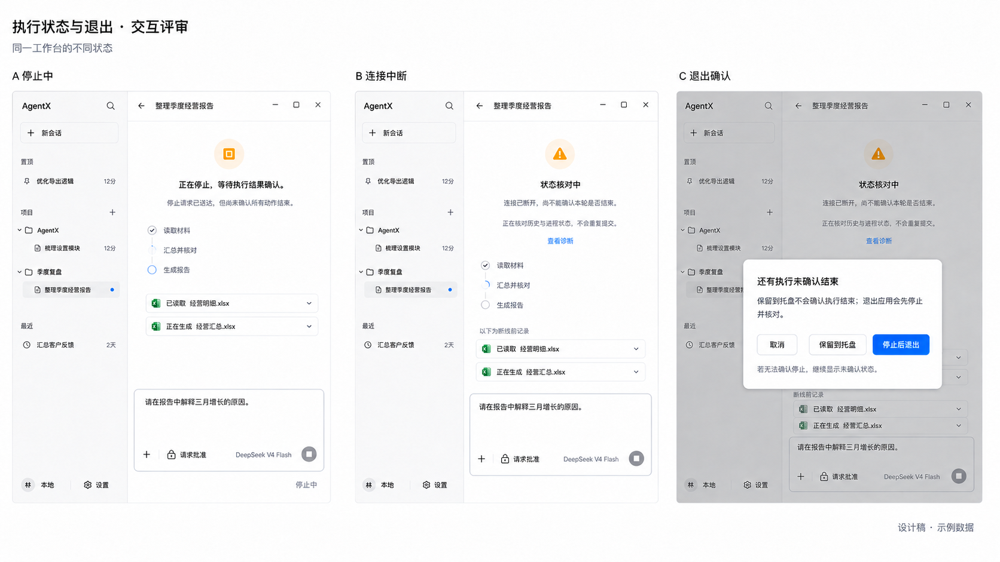

已修正退出未确认状态文案，并标明断线前记录，避免把未知执行描述为确定仍在运行。

## 24 · 深色与窄窗口

所属：app-shell、workbench。对应规格：UI-COMPOSER。

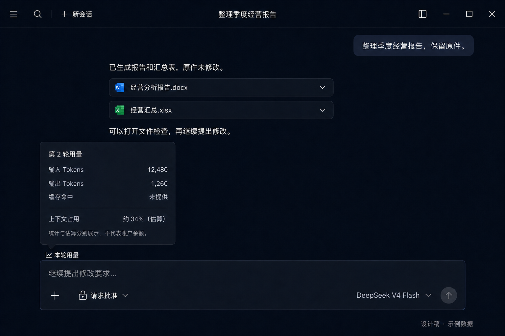

已补上本轮用量触发入口及浮层锚点；统计、缺失字段与上下文估算明确区分。
